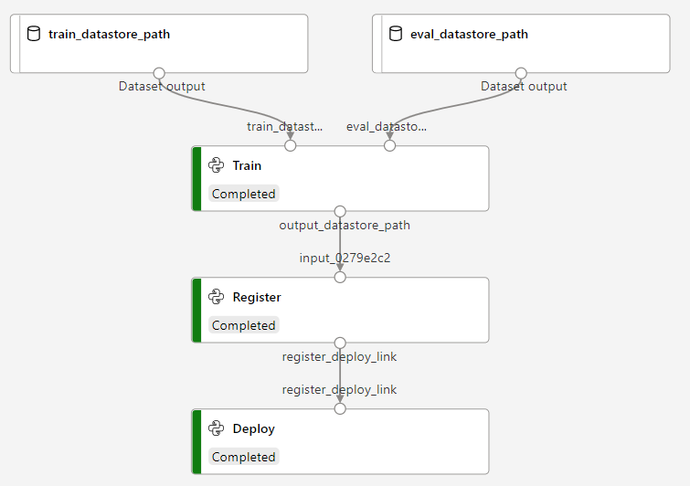

This repo explores the use of pretrained NLP models for Language Modeling offered by HuggingFace, shows how to finetune the pretrained model over your data, and how to train and deploy using Azure Machine Learning Pipelines.

The repo is divided into two parts:

* notebooks: contains all notebooks that explore the use of huggingface pretrained APIs, and how to finetune the pretrained models locally over custom data with Tensorflow and how to use finetuned models to generate next token or next texts.

    * `notebooks/LanguageModelingPretrained.ipynb`: 
        *  Masked Language Modeling: Shows how we can perform Masked Language Modeling and Next Sentence Prediction (using pretrained models in HuggingFace)
            * Explains **BERT**, **RoBERTa** & **CamemBERT models**.
            * Checks out the different API versions offered by HuggingFace.
            * Checks out how we can use them using huggingface's pipeline class & Tensorflow model specific classes to predict masked tokens. 
            * Runs them over a list of examples to show the results.
        
        * Casual Language Modeling: Shows how we can generate sequences' next token or texts.
            * Explains GPT2 model.
            * Checks out the different API versions offered by HuggingFace. (**gpt2** & **asi/gpt2-fr**)
            * Checks out how we can use them using huggingface's pipeline class & Tensorflow model specific classes to predict next token or generate texts.
            * Runs them over a list of examples to show the results.

    * `notebooks/FineTuneGPT2.ipynb`: 
        * This notebook will finetune the pretrained GPT2 model using tensorflow on the **banking77** dataset: https://huggingface.co/datasets/banking77
        * The dataset is loaded using HuggingFace's dataset API.
        * The objective is to create a model that will generate a domain specific language (banking domain in this case).
        * The dataset comprises 13,083 customer service queries (For debugging purposes or quicker training we use a small dataset).
        * The dataset is tokenized using the gpt2 tokenizer, all texts from the dataset are then concatenated to generate chunks of block_size of 1024.
        * The model is only trained over 3 epochs only (For debugging purposes or quicker training).
        * The final model is saved to a directory named 'output'.
        * The fine-tuned model is then used to generate bank domain specific texts.

    * `notebooks/FineTuneGPT2EOS.ipynb`: 
        * This notebook does the same as `notebooks/FineTuneGPT2.ipynb` except it adds an <EOS> token at the end of each text before concatenating.
        * The objective is to create independency between each text.
        * The final model is saved to a directory named 'outputEOS'.

    * `notebooks/FineTuneGPT2csvFiles.ipynb`:
        * This notebook does the same except that instead of loading data from HuggingFace dataset API, it reads the data from CSV files.
        * The CSV files are saved in `data/train.csv` and `data/eval.csv` from the initial banking77 dataset.
        * The final model is saved to a directory named 'outputcsvFiles'.

* AMLPipeline: contains the pipeline, the pipeline components and dependencies.
    * `AMLPipeline/FineTuneGPT2Pipeline.ipynb`: a notebook to create and submit pipeline.
        * Creates a datastore that connects to Azure blob container, uploads data to container.
        * Creates Pipeline Steps python scripts:
            * `AMLPipeline/lis_components/train/train.py`: 
                * Reads the csv files from the data paths stored in the blob container.
                * Fine-tunes GPT2 pretrained model.
                * Saves the h5 model in the outputs path stored in the blob container.
                * The script takes as arguments: the pretrained model name (like gpt2), the data paths, the outputs path, and other training arguments like number of epochs...
            * `AMLPipeline/lis_components/register/register.py`:
                * Registers the model stored the outputs path
                * This script takes as arguments the outputs path and the registered model name (this is also a pipeline parameter).
            * `AMLPipeline/lis_components/deploy/deploy.py`:
                * Deploys the registered model as ACI service.
                * This script takes as arguments the registered model name, the service name, the cpu_cores, memory_gb
                * It uses the `AMLPipeline/lis_components/deploy/score.py` as an entry script file to provide inference.
                * It uses the `AMLPipeline/lis_components/dependencies_scoring.yaml` as the dependencies file.
        * Creates the dependencies yaml file: `AMLPipeline/lis_components/dependencies.yaml`
            * Define an environment YAML file with the components steps script dependencies and create an Azure ML environment for the pipeline.
        * Creates the dependencies yaml file: `AMLPipeline/lis_components/dependencies_scoring.yaml`
            * Define an environment YAML file for scoring dependencies used by the web service.
        * Creates an Azure Machine Learning Pipeline to Run the scripts as a pipeline.
            * Creates a compute cluster with GPU to run steps on.
                * For now the GPU is not being used.
            * Defines pipeline steps: **train**, **register**, **deploy**.
            * The path to the outputs is passed as a datastore path between the steps.

        
